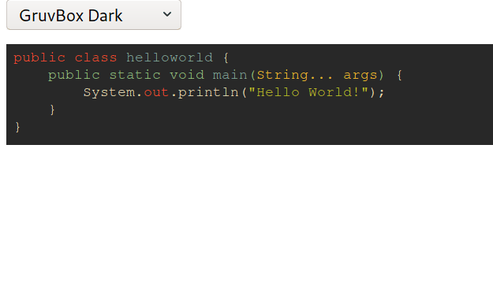

 

[Hostmystuff](https://www.hostmystuff.xyz/) is a simple private file-hosting service written in JS, using NodeJS and deployed in Docker.

The homepage contains more detailed information, including
* How to upload
    * see `scripts/test-upload.sh`
    * Or also my [personal upload script](https://github.com/JurisMajors/dotfiles/blob/master/bin/upload)
* Enabling/disabling syntax highlighting

# Features
- Syntax highlighting with automatic language detection (see [highlight.js](https://highlightjs.org/))

- API-key based authentication
- Deleting files
- Listing all information stored on database about your API-key

# Using
First get a hold of an api-key to use the service (see below).
See file `clients/hostmystuff` for a simple client written in bash for interacting with files.
This client allows you to delete or upload files, upload input from stdin and list information regarding your api-key in hostmystuff database.

Make sure that you implemenet get_key to work for your particular system.

See `-h` for all available options and information.

# API Keys
## How to get one?
Contribute to the project or get in contact with me and I will provide you with a key.
## Oops, my key is public!
Keys are limited to have a total of 1GB capacity. So, I don't care if your key is public. However, if you do not want your capacity to run out because other people could be using it, ask me for a new one.
# Running 
HostMyStuff runs within docker/docker-compose, therefore make sure you have it installed.
## Development mode
Development mode disables API key checking and connection to MongoDB.
Run `npm install` to install the dependencies.

If want to run w/o docker, then `node app.js --mode=dev` 
See `--help` for usage of additional options.

If want to run in docker, then first build the container `docker-compose build` and run it with `docker-compose -f dev-compose.yml up -d`.
The `dev-compose.yml` specifies the development mode flag for run-time.

Both methods will serve the website on `localhost:8080` and you can use `scripts/test-dev-upload.sh` for file uploading.

## Production mode
Running `docker-compose up --build -d` will build and serve the website on `localhost:8080` and database on `localhost:27017`.
Adding new keys can be done by running `node ./src/key-creator.js`.

# TODO
Feedback and requested features are always welcome!

- [ ] CLI App for file management
# DONE
- [x] CI/CD
- [x] Automatic gpg key addition from a file on deployment (need CI/CD first)
- [x] Syntax highlighting
- [x] Digital signature based authentication (Deprecated)
- [x] Dockerize
- [x] API-Key-based authentication
- [x] Delete or list info about the client
